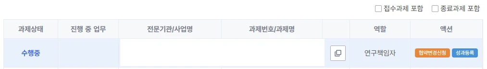
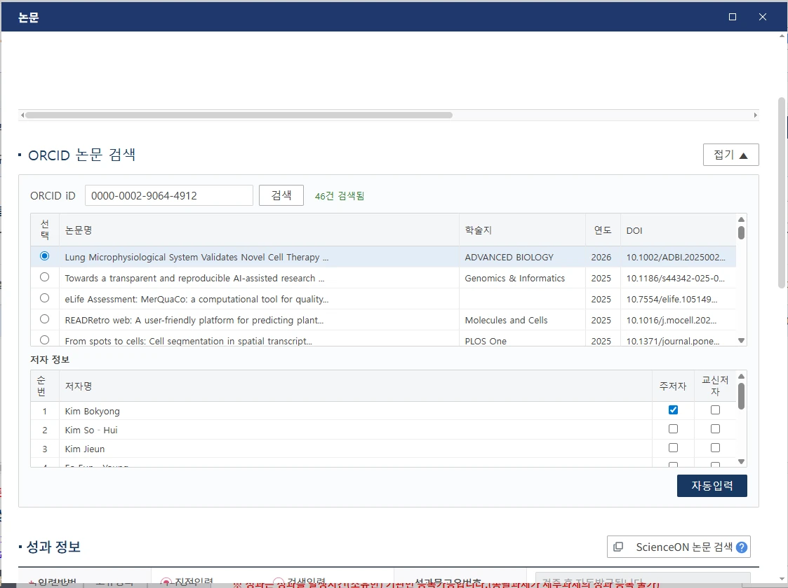

# Better IRIS

[IRIS](https://www.iris.go.kr/) (국가연구개발통합정보시스템) 사용성을 개선하는 Tampermonkey 유저스크립트입니다.

## 스크린샷

### 마이R&D 대시보드

마이R&D 과제 목록에 액션 버튼이 추가됩니다. 주황색 **협약변경신청** 버튼(연구책임자에게만 표시)을 클릭하면 해당 과제의 협약변경신청 페이지로 바로 이동합니다. 파란색 **성과등록** 버튼을 클릭하면 과제번호가 자동 입력된 성과등록 페이지로 이동합니다.

### ORCID 논문 자동입력

논문 등록 모달에 ORCID 논문 검색 섹션이 삽입됩니다. ORCID iD를 입력하고 검색하면 논문 목록이 표시됩니다. 논문을 선택하면 저자 목록이 로드되며, 체크박스로 주저자/교신저자를 지정할 수 있습니다. **자동입력** 버튼을 클릭하면 논문명, 학술지명, DOI, 날짜, 저자, 초록, 발행국가 등 모든 필드가 자동으로 채워집니다.

## 주요 기능

### 마이R&D 대시보드 개선
- 과제 목록에 액션 버튼 추가 (협약변경신청, 성과등록)
- 클릭 한 번으로 해당 페이지 바로 이동

### ORCID 논문 자동입력
- 논문 등록 모달에 ORCID 검색 UI 삽입
- ORCID iD로 논문 검색 (마지막 검색된 ORCID는 브라우저에 자동 저장)
- Crossref에서 논문 메타데이터 자동 입력:
  - 논문명 (주언어/타언어), 학술지명, DOI, ISSN, ISBN
  - 볼륨번호, 페이지, 게재일자/출판일자
  - 저자 (주저자/공저자/교신저자/발행기관)
  - 초록 (Crossref에 없을 경우 OpenAlex, Semantic Scholar, Europe PMC 순으로 검색)
  - 국제공동연구 여부, 키워드
  - 발행국가 (OpenAlex 조회 + 수동 보정 지원)
- 정렬 가능한 논문 검색 결과 테이블
- 저자별 주저자/교신저자 체크박스 선택

## 설치 방법

1. [Tampermonkey](https://www.tampermonkey.net/) 브라우저 확장 프로그램 설치
2. 새 유저스크립트를 생성하고 `better-iris.js` 내용을 붙여넣기

## 발행국가 수동 보정

OpenAlex에서 조회되는 발행국가가 잘못 표시되는 경우가 있습니다. 이 경우 `journal-country-overrides.json` 파일에 ISSN과 올바른 IRIS 국가 코드(`PH****`)를 매핑하여 수동 보정합니다.

유저스크립트는 GitHub raw URL에서 이 파일을 먼저 확인한 후, 해당 ISSN이 없으면 OpenAlex로 조회합니다.

추가로 발행국가 보정이 필요한 ISSN이 있는 경우 Issue에 남겨주시기 바랍니다.

## 라이선스

MIT
